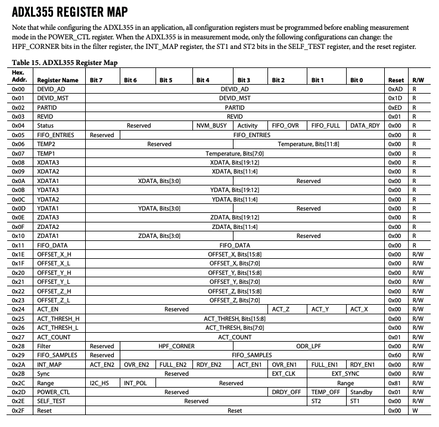

# ADXL355 Python
## Installation

*Recommand usage of virtual environment.*

Installation to collect data of the `ADXL355` accelerometer

```

# Install and create virtual environment
sudo apt-get install -y python3-venv
python3 -m venv ./venv
source venv/bin/activate

# in (venv)
pip3 install -r requirements.txt
python3 driver.py
```

## ADXL355 Documents

Reference: [ADXL355 Data-Sheets of Analog Devices Inc.](https://www.analog.com/media/en/technical-documentation/data-sheets/adxl354_adxl355.pdf)

## Registers



- There are 36 registers consisting of data(9 registers), power, and etc.
* The unit of a register is a Byte(8 bits)